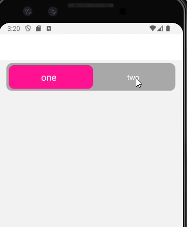
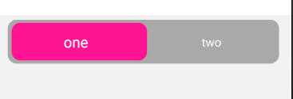

## A dynamic Switch / toggle button that response to the touch with animation.

### It comes with a built-in TypeScript typings and is compatible with all popular JavaScript frameworks. You can use it directly or leverage well-maintained wrapper packages that allow for a more native integration with your frameworks of choice.

# Example:

> **Dataset Properties**

| Name              | Type       | Default |
| ----------------- | ---------- | ------- |
| leftText          | string     |
| rightText         | string     |
| onClickLeft       | () => void |
| onClickRight      | () => void |
| outerViewStyle    | ViewStyle  |
| innerViewStyle    | ViewStyle  |
| buttonsStyle      | ViewStyle  |
| activeButtonStyle | ViewStyle  |

activeColor?: string;
unActiveTextColor?: string;
unActiveBackColor?: string;
horizontalOffset?: number;
textSelectedStyle?: TextStyle;
textUnSelectedStyle?: TextStyle;
deafultSelectedIndex: number;
